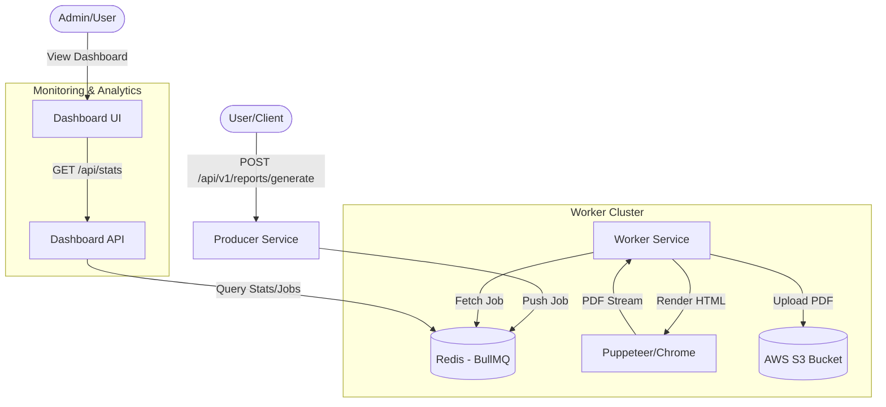
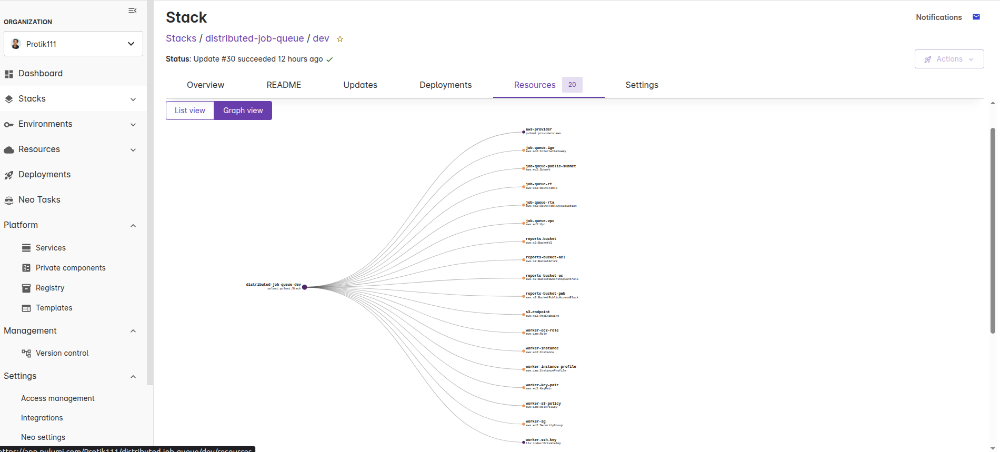
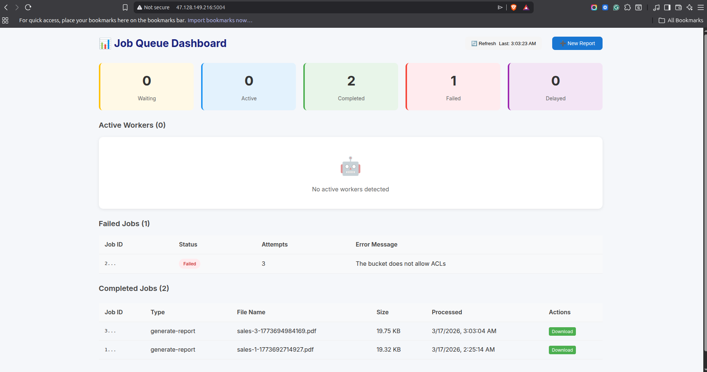

# Distributed Job Queue System

## 1. Executive Summary
This project implements a production-grade distributed job queue system designed for asynchronous report generation. Leveraging a decoupled microservices architecture, it ensures high availability, scalability, and reliability by using Redis as a message broker and AWS S3 for persistent storage.



---

## 2. Project Structure Overview

The repository is organized into distinct sub-modules to separate infrastructure, frontend, and backend services.

```text
.
├── dashboard-api/          # Express.js service providing queue analytics
├── dashboard-frontend/     # React + Vite UI portal
├── producer/               # Entry point for submitting new job requests
├── worker/                 # Core processing engine
├── infra/                  # Docker Compose files for local/prod environments
├── infra-pulumi/           # Infrastructure as Code (AWS provisioner)
├── docs/assets/            # Architectural diagrams and screenshots
└── assignment_report.md    # Detailed project documentation
```

---

## 3. System Architecture & Design Decisions

### 3.1 Component Role Breakdown
- **Producer**: Acts as the gateway. It validates input and pushes a "generate-report" job into the Redis `report-queue`.
- **Worker**: The "heavy lifter". Multiple replicas can run concurrently to drain the queue.
- **Scheduler**: A lightweight monitor that ensures jobs don't stay in "active" state forever if a worker crashes.

### 3.2 Technical Tradeoffs
- **BullMQ over plain Redis**: BullMQ handles the complexity of atomic operations and job state transitions, reducing the risk of data races.
- **S3 vs Local Storage**: Local storage is ephemeral in Docker. Using S3 ensures that reports persist across container restarts and scale-outs.

---

## 4. Worker Service Internals

The Worker Service is the most critical part of the system, handling intensive PDF generation tasks.

### 4.1 Job Processing Lifecycle
1.  **Job Claim**: A worker pulls a job from Redis and sets a lock (default 5 mins).
2.  **Rendering**: The `report.processor.ts` generates dynamic HTML based on the job payload.
3.  **PDF Generation**: A local Puppeteer instance (Headless Chrome) renders the HTML.
4.  **S3 Persistence**: The raw PDF buffer is uploaded to AWS S3.
5.  **Completion**: The worker updates the job status in Redis and releases the lock.

### 4.2 Error Handling & Concurrency
- **Concurrency**: Each worker is configured to handle `WORKER_CONCURRENCY=2` jobs simultaneously.
- **Automatic Retries**: If Puppeteer fails, BullMQ automatically retries the job up to 3 times with exponential backoff.

---

## 5. API Documentation

- **POST `5001/api/v1/reports/generate`**: Submit a new report job.
- **GET `5003/api/stats`**: Real-time counts of waiting/active/completed/failed jobs.
- **GET `5003/api/workers`**: Lists all active workers and their health heartbeats.
- **GET `5003/api/jobs/completed`**: Fetches the last successfully generated reports.

---
6. Local Development with Docker

This project provides a pre-configured Docker environment for seamless local development. This setup includes Redis, the Producer, Worker, Scheduler, and Dashboard services.

### 6.1 Prerequisites
- [Docker](https://docs.docker.com/get-docker/)
- [Docker Compose](https://docs.docker.com/compose/install/)

### 6.2 Setup Instructions

1. **Environment Variables**:
   Copy the example environment file and update it with your configuration (e.g., S3 credentials if needed for full functionality):
   ```bash
   cp .env.example .env
   ```

2. **Start Services**:
   Navigate to the `infra` directory and start the containers:
   ```bash
   cd infra
   docker-compose up --build
   ```

3. **Access Services**:
   - **Dashboard UI**: [http://localhost:5004](http://localhost:5004)
   - **Producer API**: [http://localhost:5001](http://localhost:5001)
   - **Dashboard API**: [http://localhost:5003](http://localhost:5003)
   - **Redis**: `localhost:6379`

### 6.3 Common Commands

- **Stop Services**: `docker-compose down`
- **View Logs**: `docker-compose logs -f`
- **Scale Workers**: `docker-compose up --scale worker=3 -d`

---

7. Infrastructure & CI/CD Pipeline

### 7.1 Infrastructure (Pulumi)
The project uses **Pulumi (TypeScript)** to manage networking, compute, and storage. Below is a snapshot of the provisioned resources in the AWS console:



### 7.2 CI/CD Workflow (GitHub Actions)
The system is deployed via an automated pipeline defined in `.github/workflows/aws-ec2-deploy.yml`:

1.  **Trigger**: On push to `main` branch.
2.  **Infra Refresh**: Pulumi ensures the AWS environment is up-to-date.
3.  **SSH Deployment**: Runner connects via SSH to pull code and restart services.

Below is the live application running on an AWS EC2 instance:



---

## 8. Conclusion
This system demonstrates a robust, production-ready distributed job queue using modern engineering practices and cloud-native infrastructure.
