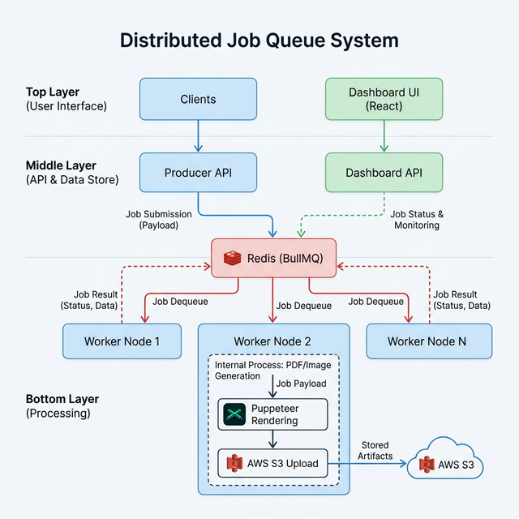

# Portfolio: Distributed Job Queue System

**GitHub Repository:** [https://github.com/Protik111/distributed-report-queue](https://github.com/Protik111/distributed-report-queue)

## 1. Executive Summary
A production-grade distributed job queue system designed for asynchronous report generation. Leveraging a decoupled microservices architecture, it ensures high availability, scalability, and reliability by using Redis as a message broker and AWS S3 for persistent storage.

## 2. Architecture & System Design

### Key Components
- **Producer**: Acts as the gateway. It validates input and pushes a "generate-report" job into the Redis queue.
- **Worker**: The "heavy lifter". Multiple replicas run concurrently to drain the queue. Processes HTML and generates PDFs via Puppeteer.
- **Scheduler**: A lightweight monitor ensuring jobs don't hang indefinitely if a worker crashes.
- **Dashboard UI & API**: Real-time queue analytics and system health monitoring UI.

### Technical Stack
- **Languages/Frameworks**: Node.js, Express.js, React + Vite, TypeScript
- **Infrastructure**: Docker, AWS (S3, EC2), Redis
- **Message Broker**: BullMQ
- **IaC & CI/CD**: Pulumi (TypeScript), GitHub Actions

## 3. Worker Internals & PDF Generation
The Worker Service manages intensive PDF generation tasks:
1. **Job Claim**: A worker locks a job from Redis.
2. **Rendering & PDF Generation**: Generates dynamic HTML and renders a PDF via Headless Chrome (Puppeteer).
3. **S3 Persistence**: The generated PDF is uploaded directly to AWS S3.
4. **Completion/Retry**: The worker releases the lock or automatically retries with exponential backoff upon failure.

## 4. Cloud Deployment & Infrastructure Snapshot
The system is deployed using **Pulumi** to manage networking, compute, and storage on AWS. Below is a snapshot of the provisioned resources in the AWS console:

A live snapshot of the dashboard analytics UI running on the provisioned AWS EC2 instance:

## 5. Key Strengths
- **Decoupled Architecture**: Highly available and easily scalable horizontally by adding more worker processes.
- **Robust Persistence**: S3 provides reliable, highly accessible, and fault-tolerant storage for generated artifacts.
- **Modern GitOps Pipeline**: Automated infrastructure provisioning with Pulumi and deployment using GitHub Actions limit downtime and human errors.
